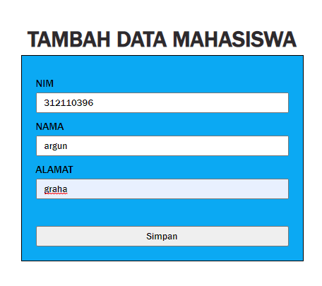
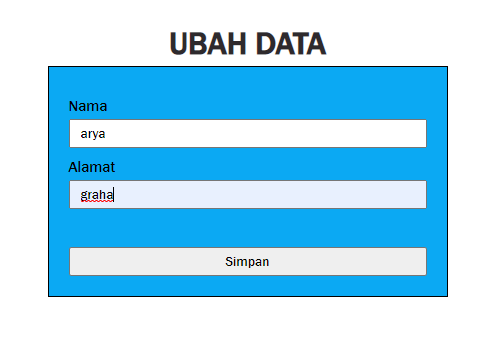
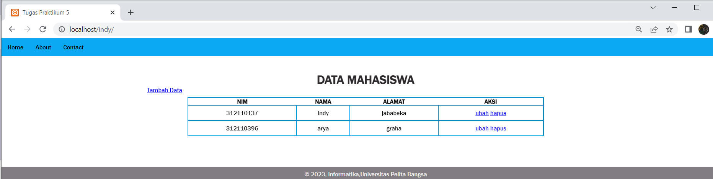

## **tambah data**


### _Code :_
```
<?php 
include_once 'koneksi.php';

if (isset($_POST['submit'])) {
    $nim = $_POST['nim'];
    $nama = $_POST['nama'];
    $alamat = $_POST['alamat'];
    $sql = 'INSERT INTO input (nim, nama, alamat) ';
    $sql .= "VALUE ('{$nim}', '{$nama}','{$alamat}')";
    $result = mysqli_query($conn, $sql);
    header('location: index.php');
}
?>
<!DOCTYPE html>
<html lang="en">
<head>
    <meta charset="UTF-8">
    <meta http-equiv="X-UA-Compatible" content="IE=edge">
    <meta name="viewport" content="width=device-width, initial-scale=1.0">
    <link href="style.css" rel="stylesheet" type="text/css" />
    <title>Tambah Data</title>
</head>
<body>
    <br>
    <div class="container">
        <div class="main">
            <h1>Tambah Data Mahasiswa</h1>
            <form method="post" action="index.php" enctype="multipart/form-data">
                <div class="input">
                    <label>NIM</label>
                    <input type="text" name="nim" />
                </div>
                <div class="input">
                    <label>NAMA</label>
                    <input type="text" name="nama"  />
                </div>
                <div class="input">
                    <label>ALAMAT</label>
                    <input type="text" name="alamat"  />
                </div>
                <br>
                <div class="submit">
                    <input type="submit" name="submit" value="Simpan" />
                </div>
            </form>
        </div>
</body>
</html>
```

### _Output :_



</br></br>

## **ubah data**


### _Code :_
```
<?php
error_reporting(E_ALL);
include_once 'koneksi.php';

if (isset($_POST['submit'])) {
    $nim = $_POST['nim'];
    $nama = $_POST['nama'];
    $alamat = $_POST['alamat'];

    $sql = 'UPDATE input SET ';
    $sql .= "nama = '{$nama}', alamat = '{$alamat}', ";
    $sql .= "WHERE nim = '{$nim}'";
    $result = mysqli_query($conn, $sql);

    header('location: home.php');
}

$sql = "SELECT * FROM input WHERE nim = '{$nim}'";
$result = mysqli_query($conn, $sql);
if (!$result) die('Error: Data tidak tersedia');
$data = mysqli_fetch_array($result);
function is_select($var, $val)
{
    if ($var == $val) return 'selected="selected"';
    return false;
}
?>
<!DOCTYPE html>
<html lang="en">

<head>
    <meta charset="UTF-8">
    <link href="style.css" rel="stylesheet" type="text/css" />
    <title>Ubah Data</title>
</head>

<body>
    <div class="container">
        <div class="main">
            <h1>Ubah Data</h1>
            <form method="post" action="ubah.php" enctype="multipart/form-data">
                <div class="input">
                    <label>Nama</label>
                    <input type="text" name="nama" />
                </div>
                <div class="input">
                    <label>Alamat</label>
                    <input type="text" name="alamat" />
                </div>
                <br>
                <div class="submit">
                    <input type="submit" name="submit" value="Simpan" />
                </div>
            </form>
        </div>
    </div>
```

### _Output :_



</br></br>

## **halaman home**


### _Code :_
```

<?php
include("koneksi.php");

// query untuk menampilkan data
$sql = 'SELECT * FROM input';
$result = mysqli_query($conn, $sql);
?>

<div class="content">
  <h1>DATA MAHASISWA</h1>
  &nbsp;&nbsp;&nbsp;&nbsp;&nbsp;&nbsp;&nbsp;&nbsp;&nbsp;&nbsp;&nbsp;&nbsp;&nbsp;&nbsp;&nbsp;&nbsp;&nbsp;&nbsp;&nbsp;&nbsp;&nbsp;&nbsp;&nbsp;&nbsp;&nbsp;&nbsp;&nbsp;&nbsp;&nbsp;&nbsp;&nbsp;
  &nbsp;&nbsp;&nbsp;&nbsp;&nbsp;&nbsp;&nbsp;&nbsp;&nbsp;&nbsp;&nbsp;&nbsp;&nbsp;&nbsp;&nbsp;&nbsp;&nbsp;&nbsp;&nbsp;&nbsp;&nbsp;&nbsp;&nbsp;
  &nbsp;&nbsp;&nbsp;&nbsp;&nbsp;&nbsp;&nbsp;&nbsp;&nbsp;&nbsp;&nbsp;&nbsp;&nbsp;&nbsp;&nbsp;&nbsp;&nbsp;&nbsp;&nbsp;&nbsp;&nbsp;&nbsp;&nbsp;
  &nbsp;&nbsp;&nbsp;&nbsp;&nbsp;&nbsp;&nbsp;&nbsp;&nbsp;
  <a href="tambah.php">Tambah Data</a>
  <div class="main">
    <table>
      <tr>
        <th>NIM</th>
        <th>NAMA</th>
        <th>ALAMAT</th>
        <th>AKSI</th>
      </tr>
      <?php if ($result) : ?>
        <?php while ($row = mysqli_fetch_array($result)) : ?>
          <tr>
            <td><?= $row['nim'];?></td>
            <td><?= $row['nama'];?></td>
            <td><?= $row['alamat'];?></td>
            <td>
              <a href="ubah.php?id=<?= $row['nim']; ?>">ubah</a>
              <a href="hapus.php?id=<?= $row['nim']; ?>">hapus</a>
            </td>
          </tr>
        <?php endwhile; else : ?>
        <tr>
          <td colspan="7">Belum ada data</td>
        </tr>
      <?php endif; ?>
    </table>
  </div>
</div>

<?php require("footer.php");?>
```

### _Output :_



</br></br>

